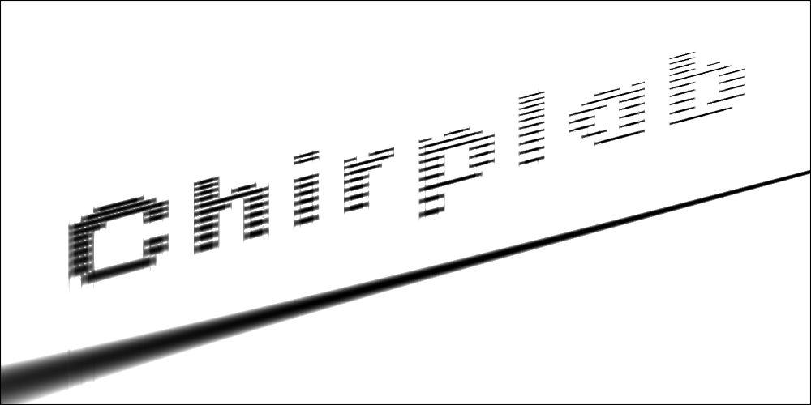
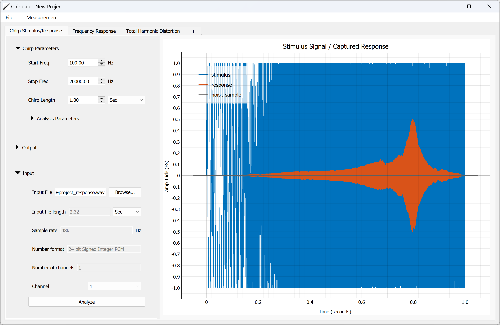
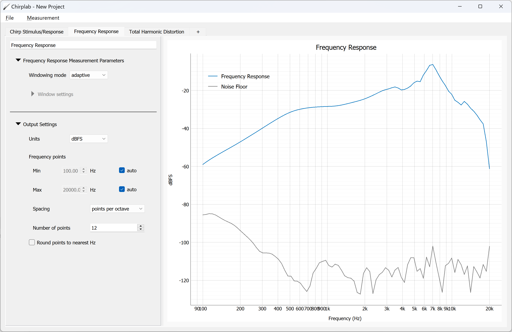
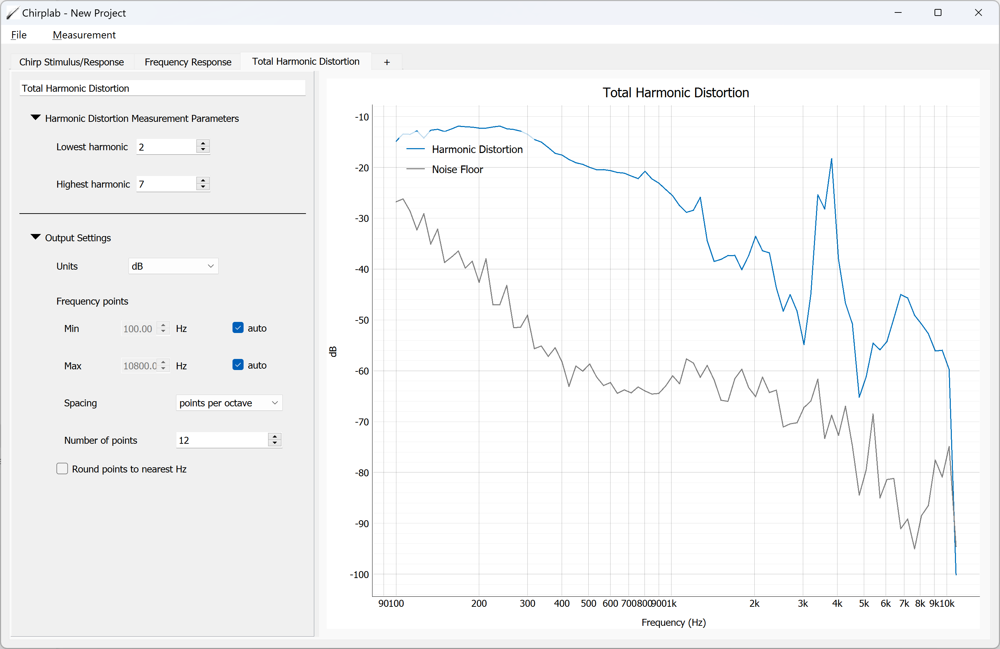
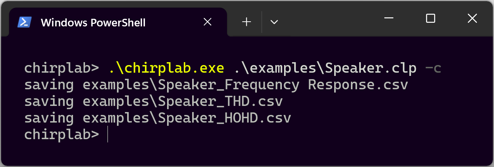

# Chirplab
Chirplab is an audio and acoutics measurement suite based on fast open-loop log-swept sine chirp generation, capture, and analysis.

<picture></picture>

Chirplab is built on Python, NumPy/SciPy, Qt, and other open source software and is released under the [MIT license](LICENSE)

## Overview
Chirplab can be used as a standalone GUI for interactively examining measurement data and experimenting with different project parameter settings, or entirely via a command line interface using plaintext project file input and measurement data output. This allows a seamless transision between R&D and automated or manufacturing workflows, and even allows custom Chirplab measurements to be incorporated into other audio test software that can call external programs as part of a measurement sequence. Chirplab is early in development, but will eventually support a wide variety of standard and specialized audio measurements.

<picture></picture>

 

<picture></picture>

 

<picture></picture>

 

<picture></picture>

## Project Goals
In most respects Chirplab is entirely conventional and all of the processing that it performs is based on DSP literature, readily available research papers, and experimentation to produce measurement outputs that are roughly equivalent to those produced by commercial audio test systems. However, Chirplab has a slightly different focus and has some key capabilities that are not found in any other software

### Measurement noise floor
Where most audio measurement tools have some sort of noise floor measurement feature, almost none of them make any connection between the system noise floor and its real impact on other measurements. Chirplab captures a section of the system noise floor equal in length to the stimulus chirp, processes that through the same calculations as the regular response, and gives you an estimate of the noise floor *for that measurement*. This gives you a quick sanity check on your measurement data, which can save a lot of time during research or debugging efforts, especially when measuring distortion products that are close to the system noise floor.

<!-- todo: insert a couple graphs to illustrate what measurement noise floor does -->

 

### Comprehensive distortion measurements
Some standardized metrics for audio distortion measurement exist, but those standards do not comprehensively cover the range of distortion mechanisms and products that audio engineers would like to measure. In practice, "distortion", "THD", "Rub and "Buzz" and other terms are poorly defined. Different measurement systems will yield significantly different results for measurements with the same name and measurement methodologies are usually not communicated clearly with measurement results.

Chirplab currently only supports Harmonic Distortion measurements (equivalent to "THD", "HOHD", "Distortion Product Level", etc.), but a wide variety of distortion metrics that provide equivalent results from other measurement systems will be added over time.

 

### Fine control over measurement parameters
One of the disconnects between different measurement systems having measurements with the same name but different results is that they use very similar algorithms, but hide the parameters used for analysis. "THD" almost always start with the 2nd harmonic, but may include harmonics up to 7, 10, or 35, and *many measurement systems don't give the user any control over the range used*. Chirplab gives the user control over all of the critical analysis parameters for a particular measurement. Unfortunately, the user is still responsible for clearly communicating the context of the measurement and settings used when they share measurement results. 🙃

At this time all major measurement parameters are exposed in the GUI, but in the future some measurements may hide parameters that are obscure or easy to misconfigure within the project file. If you are seeing results that do not align with your expectations or you don't see parameters that you expect to be able to control, please [raise an issue](https://github.com/loudifier/chirplab/issues).

 

### Seamless workflow between GUI and CLI
The Chirplab GUI and CLI produce 1:1 measurement results. You can easily set up all of your chirp and measurement parameters in the GUI, previewing results and refining settings with immediate feedback, and saving the configurations to a plaintext YAML project file. Then you can automate repeated measurements or batch process different input measurement recordings using the same project file created in the GUI.

The CLI is simple and is run using the same main script/executable as the GUI. There is no server, API, or Chirplab interface library. You should not need to understand any of the underlying code heirarchy to make basic configuration changes or call Chirplab measurements from an automation process or other audio test program that allows external processing steps.

 

### Open loop signal path as a first-class test setup
With the decreasing number of audio devices that provide realtime audio passthrough (i.e. mobile devices that allow you to sideload, play, and record files but not stream audio to/from a host PC) and increasing number of devices that only have variable-latency connections like Bluetooth, modern audio testing needs to be able to handle fully open loop testing. **All** Chirplab measurements are open loop-native, meaning all processing performs automatic chirp response time alingment, even when using soundcard input and output. Some measurements may require a pilot tone for time alignment in the future, but cross correlation time alingment is used now and should be sufficient for the vast majority of analyses.

 

## Project Status
Chirplab v0.2 is in an initial usable state, supporting file and sound card input and output and a few basic measurements - Frequency Response, Phase Response, and Harmonic Distortion. It will eventually support acoustic/electrical signal level calibration and several additional measurement types, including equivalent measurements to those that you would expect from commercial audio measurement systems and some entirely unique distortion metrics. See the [roadmap](ROADMAP.md) for a high level list of currently implemented and planned features. Contributions are welcome.

If you have a specific feature request not on the roadmap, find a bug, have an audio file or signal that does not play nicely with Chirplab, etc. please [raise an issue](https://github.com/loudifier/chirplab/issues).